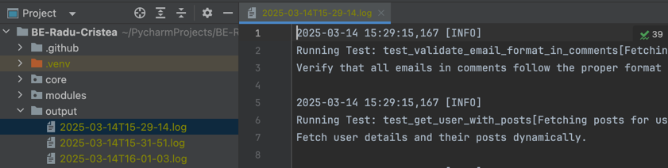

# API Testing Framework

##  Project Overview
This repository contains an automated test suite for validating the behavior, performance, and reliability of the JSONPlaceholder API. The tests are structured into multiple categories, including functional, validation, negative, and performance tests.

---

##  Installation & Setup
### Prerequisites
- Python **3.10.8**
- `pip` package manager
- `virtualenv` (recommended for dependency isolation)

### Installation Steps
1. Clone the repository:
   ```sh
   git clone https://github.com/cristearadu/BE-Radu-Cristea.git
   cd BE-Radu-Cristea
   ```

2. Run the setup command:
   ```sh
   make setup
   ```

### If `make setup` does not work, follow the steps below:

1. Create and activate a virtual environment (recommended):
   ```sh
   python -m venv .venv
   source .venv/bin/activate  # On macOS/Linux
   .venv\Scripts\activate    # On Windows
   ```


2. Install dependencies:
   ```sh
   pip install -r requirements.txt
   ```

3. Verify the installation:
   ```sh
   pytest --version
   ```

---

## 🛠️ Running Tests

### Running Tests Locally (without XML/HTML reports)
To execute the test suite locally without generating reports, run:
```sh
pytest -n auto -v -m regression
```

### Running Tests with Reports (Which I Recommend)
For HTML report generation:
```sh
pytest -n auto -v -m regression \
  --html=report.html --self-contained-html
```

- **JUnit XML Report:** `report.xml` (used for GitHub CI, add `--junitxml=report.xml` if needed locally)
- **HTML Report:** `report.html` (easy-to-read test summary)

### Running Specific Test Suites
You can run specific test categories using `pytest -m <marker>`:
```sh
pytest -m regression # Run all tests
pytest -m smoke      # Run smoke tests
pytest -m validation # Run validation tests
pytest -m negative   # Run negative tests
pytest -m performance # Run performance tests
```

---

## Continuous Integration (CI/CD)
### GitHub Actions Workflow
This repository includes a GitHub Actions workflow (`.github/workflows/api-tests.yml`) to automate test execution on:
- **Pushes & Pull Requests** to `main`
- **Scheduled Runs** (every midnight UTC)
- **Manual Trigger** via GitHub Actions (workflow dispatch)

### Running Tests in CI/CD
You can **manually trigger** tests from GitHub Actions by selecting:
- **Branch** to run the tests on
- **Test suite** (`smoke`, `regression`, `validation`, `negative`, `performance`)

Alternatively, tests are executed in CI/CD using:
```sh
pytest -n auto -m <test_suite> --junitxml=report.xml --html=report.html --self-contained-html
```
Example:
```sh
pytest -n auto -m regression --junitxml=report.xml --html=report.html --self-contained-html
```

### Running Tests Manually in GitHub Actions
1. Navigate to the **Actions** tab in the GitHub repository.
2. Select the **API Tests** workflow.
3. Click **"Run workflow"**.
4. Choose:
   - **Branch** to run tests on.
   - **Test suite** (`smoke`, `regression`, etc.).
5. Click **Run workflow** to start the tests.


### Running Tests Manually in GitHub Actions


### Test Artifacts
After each run, the following artifacts are uploaded:
- **HTML Test Report** (`report.html`)
- **Test Logs** (`output/` directory)

---

## Logging & Reporting
- **Live Logs**: `pytest.ini` is configured to log all test execution details.
- **Stored Logs**: Test execution logs are saved in the `output/` directory.

- **Reports**: Detailed HTML reports are generated after test runs. XML reports are used only in GitHub CI/CD, but can be generated locally with `--junitxml=report.xml`.

---

## Technology Stack Justification

### Why Python + Pytest + Requests?
This project is built using **Python**, **Pytest**, and **Requests**, chosen for their efficiency, flexibility, and extensive support in API testing. Here’s why:

1. **Python**
   - Readable and concise syntax, ideal for writing maintainable test code.
   - Strong ecosystem with libraries supporting automation, API testing, and reporting.
   
2. **Pytest**
   - Powerful and scalable testing framework with built-in fixtures, parameterization, and parallel execution.
   - Provides detailed assertion debugging and supports markers for test categorization (e.g., `smoke`, `regression`).
   - Provides usage of fixture support as it makes setup and teardown run in different scopes.
   
3. **Requests**
   - Simplifies API interactions with easy-to-use HTTP methods and response handling.
   - Integrates seamlessly with Pytest for efficient validation of API responses.
   
The combination of these technologies allows for:
- **Efficient test execution** with parallelization (`pytest-xdist`).
- **Scalable test organization** using layered architecture and design patterns.
- **Comprehensive reporting** through JUnit XML and HTML reports.
- **Seamless integration** into CI/CD pipelines via GitHub Actions.

---

## Design Patterns & Architecture

Key patterns used and their implementation details:

### 1. Service Object Pattern
   - **Description:** Encapsulates API interactions into reusable service classes.
   - **Implementation:**  
     - Located in [`modules/backend_tests/helpers/user_comments_helper.py`](modules/backend_tests/helpers/user_comments_helper.py).
   - **Purpose:**  
     - Ensures separation of concerns by isolating API request logic from test cases.  
     - Allows better test maintainability and reuse.

### 2. Builder Pattern
   - **Description:** Provides a structured way to construct API requests dynamically.
   - **Implementation:**  
     - Applied in [`modules/backend_tests/general/request_builder_user_comments.py`](modules/backend_tests/general/request_builder_user_comments.py).
   - **Purpose:**  
     - Helps in dynamically generating API request payloads.  
     - Avoids hardcoded request structures in test cases.

### 3. Factory Pattern
   - **Description:** Centralizes the creation of test data and reusable API fixtures.
   - **Implementation:**  
     - Utilized in [`conftest.py`](conftest.py) for defining reusable Pytest fixtures.
   - **Purpose:**  
     - Provides pre-configured API clients, test users, and predefined data.  
     - Enhances test reusability.

### 4. Request Object Model (API Testing)
   - **Description:** Encapsulates API endpoints as structured objects for easier test interaction.
   - **Implementation:**  
     - Defined in [`modules/backend_tests/controllers/jsonplaceholder_request_controller.py`](modules/backend_tests/controllers/jsonplaceholder_request_controller.py).
   - **Purpose:**  
     - Promotes modularity in API testing.  
     - Makes API interactions easier to maintain and extend.

### 5. Layered Architecture
   - **Description:** A structured framework ensuring clean separation of concerns.
   - **Implementation:**  
     - **Test Layer:** `modules/backend_tests/tests/` (Contains test cases).  
     - **Service Layer:** `modules/backend_tests/helpers/` (Implements business logic).  
     - **Request Layer:** `modules/backend_tests/controllers/` (Handles API calls).  
     - **Data Layer:** `modules/backend_tests/general/request_builder_user_comments.py` (Manages request payload construction).
   - **Purpose:**  
     - Ensures that different responsibilities are clearly separated.  
     - Improves code maintainability and readability.


---

##  Test Suite Overview
| Test Name                                  | Category    | Description |
|--------------------------------------------|------------|-------------|
| `test_get_user_with_posts`                 | Functional | Fetch user details and validate posts exist |
| `test_get_comments_for_valid_posts`        | Functional | Validate comments retrieval for valid posts |
| `test_validate_comment_structure`          | Validation | Ensure all comments have required fields and types |
| `test_validate_comment_values`             | Validation | Verify meaningful values for comments |
| `test_comments_missing_required_fields`    | Validation | Ensure comments are not missing any required fields |
| `test_comments_unexpected_extra_fields`    | Validation | Check if API returns unexpected extra fields |
| `test_validate_email_format_in_comments`   | Validation | Validate email formatting in comments |
| `test_no_duplicate_comments`               | Validation | Check that duplicate comments do not exist |
| `test_get_comments_for_invalid_post_id`    | Negative   | Check API behavior with invalid post IDs |
| `test_unexpected_status_codes`             | Negative   | Ensure API does not return unexpected HTTP status codes |
| `test_unexpected_server_errors`            | Negative   | Validate API does not return 5XX errors or rate limits |
| `test_large_api_response`                  | Performance | Verify API handles large responses efficiently |
| `test_api_response_time`                   | Performance | Measure response time for API calls |

---

